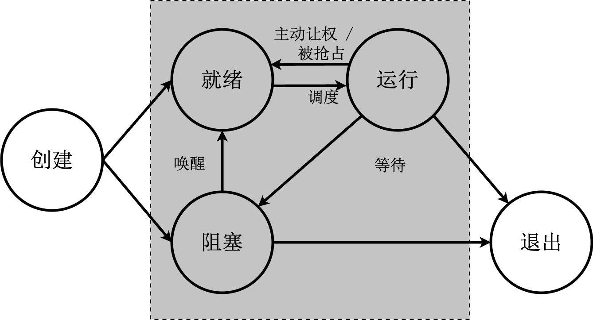

# AsyncOS 任务调度模块重构文档

这个文档用于定义与 AsyncOS 中的任务调度相关的模块，包括了基本的 API，以及一些与其他的模块相关的交互。这里结合了共享调度器的设计，并且通过 vDSO 的方式来提供。

## 任务调度的时机

- 当前任务运行完毕
- 当前任务调用阻塞原语将自己阻塞，主动让出 CPU
- 当前任务未能获取共享资源而进入睡眠状态
- 当前任务提出 I/O 请求后被阻塞
- 当前任务时间片耗尽
- 执行系统调用后返回用户程序时
- 产生高优先级任务时

## 模块化

与任务调度相关的模块包括：

- 处理器资源抽象
- 调度类分配器
- 任务封装模块
- 处理器分配器
- 队列及操作模块
- 负载均衡模块
- 任务切换模块
- 睡眠任务管理模块
- 系统调用模块
- 运行信息统计模块

## 处理器资源抽象

处理器上的硬件寄存器为：

- 通用寄存器：
- 控制寄存器
  - 页表寄存器：
  - 中断寄存器：

这些寄存器都可以在任务控制块中进行描述。

除了与寄存器相关的封装态，每个处理器上还需要存在一个调度器，运行栈池、当前运行任务、CPU 硬件的相关信息；以及定时器队列（目前是实现了共享的全局定时器，后续可以转化为每个 CPU 有各自的定时器）。

## 队列管理接口

| 接口        |      | 描述                 |
| :---------- | :--- | :------------------- |
| push        |      | 将元素添加至队列中   |
| pop         |      | 从队列中取出元素     |
| remove_task |      | 从队列中删除指定元素 |

## 任务封装

任务以协程的形式存在，任务控制块中不保存与寄存器相关的上下文，函数调用关系由编译器保存在堆上。对于任务主动进行的切换，不需要手动来保存；由于中断、异常导致的被动切换，上下文的保存应该是在 trap 相关的模块进行处理，任务调度模块提供接口，将上下文与 fut 进行绑定。

需要手动保存的上下文需要考虑任务主动调用了线程的接口，保存部分的寄存器，以及被打断后保存所有的寄存器的行为；恢复时，同样根据这两种情况都需要进行这种判断。并且需要定义好栈的占用与释放的接口。系统调用为主动的方式，其上下文由编译器来保存，其他的无论是内核还是用户态发生的中断、异常都通过这个接口来实现上下文与栈的保存和恢复。

```rust
// 保存线程寄存器
fn thread_save();
// 恢复线程寄存器
fn thread_restore();
// 保存由中断导致的寄存器
fn interrupt_save();
// 恢复由中断导致的寄存器
fn interrupt_restore();
// 栈占用
fn stack_occupy();
// 栈释放
fn stack_free();
```

## 任务调度中与状态变化相关的接口

任务状态为：创建、就绪、运行、阻塞、退出；对应的状态图如下。



创建 $\rightarrow$ 就绪：task_spawn 接口，创建任务之后，将任务添加到就绪队列中；

创建 $\rightarrow$ 阻塞：task_block 接口，接口中应该描述清楚等待的时间是什么，如果是设备初始化时，则等待的是外部事件，如果是因为资源问题，则可以应该是在其他的软件队列中；

就绪 $\rightarrow$ 运行：task_run 接口

运行 $\rightarrow$ 阻塞：task_block 接口，这种情况通常是因为等待资源而进入阻塞状态；

运行 $\rightarrow$ 就绪：task_yield 接口，任务让出当前 CPU

阻塞 $\rightarrow$ 就绪：由于外部事件达到或者资源可用，任务被唤醒

运行 $\rightarrow$ 退出：task_exit 接口，任务运行结束

阻塞 $\rightarrow$ 退出：替换设备的外部事件处理任务时会出现这种状态变化

| 接口       | 参数                   | 描述 |
| ---------- | ---------------------- | ---- |
| task_spawn | 任务的执行逻辑，名称等 |      |
| task_block | 等待的原因             |      |
| task_run   |                        |      |
| task_yield | 没有参数               |      |
| task_exit  | 退出码                 |      |

在任务状态的过程中，会出现修改了任务状态，但是任务仍然在 CPU 上运行的中间过程，这需要一些类似于忙等或者其他的方式来解决这种问题。

## 接口兼容

这里是为了保证与原始的使用线程相关的接口进行兼容，即在目前使用的完全以协程实现的模块，可能部分的模块仍然使用了线程的接口，因此需要在系统实现层面来考虑与线程接口的兼容性。

### 接口共存

这里存在的方式有：线程与协程的接口

### Per CPU 接口

需要提供 Per CPU 相关的接口来访问当前处理器上的相关信息

