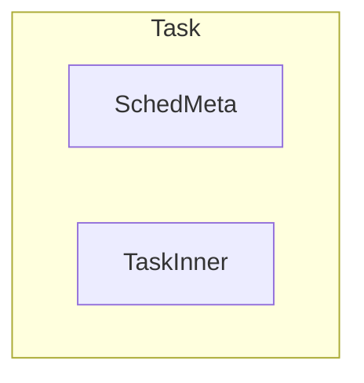

# taskctx

## 简介

本模块实现任务运行的主要数据结构有：`Task`、`StackPool`。

### `Task`

该结构代表任务。包含上下文、状态、调度器相关信息、所属 `Scheduler` 等信息。由于目前整个模块只支持协程调度，因此目前只能创建协程类型的 `Task` 对象（传入类型为 `FnOnce() -> impl (Future<Output = i32> + 'static + Send)`，对应一个声明为 `async` 的函数的函数名）。但由于上下文数据结构的设计，`Task` 具备表示线程（或被抢占、以线程方式存储上下文的协程）的能力。`Task` 为多层包含的数据结构，每一层的定义位置、功能如下图：

Task 由于调度器相关的 MetaData 以及与任务控制块相关的 TaskInner 组成，TaskInner 中包括了任务的基本信息、Future、以及上下文（包括抢占、用户态 TrapFrame）等信息。

### `StackPool`

提供对内核栈的访问操作，在默认的情况下，多个任务可以复用同一个内核栈，当需要抢占时，则会从中取出新的栈来运行协程。

### `Waker`

作为协程，`Task` 使用 `Waker` 来唤醒自身。Waker 的构建需要 `&TaskRef`，使用 `Waker.wake()` 来替换原本在调度代码中的放入就绪队列的操作，因此，任何涉及到任务控制块字段的操作都需要在此之前执行。

## 线程兼容

这个模块提供统一的任务抽象，考虑线程和协程这两种形式。

1. 使用 await、或者运行结束，以协程的形式存在；
2. 使用线程的接口，以线程的形式存在；
3. 由于中断导致的抢占时，以线程的形式存在；

协程的上下文：fut、线程的上下文：trap_frame + 内核栈

目前做到了 1 和 3，还需要将 2 和 3 结合；由于 2 和 3 之间存在着关联，例如在使用线程接口让权时，将不允许抢占，或者说直接关闭中断，避免上下文嵌套的影响，并且保存的上下文为 trap_frame 的子集。

在使用线程的接口进行线程让权时，是否要允许进入时钟中断，如果时钟中断处理发现了时间片用完，这时是需要将当前任务抢占的；但当下次这个线程恢复执行时，如果不进行处理，则还是会继续执行线程接口，让权，导致震荡。同理，在可能使用线程让权的接口之前，先发生了时钟中断，导致线程被抢占，下次恢复时，也会出现上述情况。因此，在调度的逻辑中必须增加相关的判断逻辑，让线程在时钟中断被抢占之后，恢复时能够继续执行，而不是让权。
要完全避免这种冲突会导致每次切换都增加额外的开销，并且这种冲突发生的频率很少，因此直接在 switch_to 函数中关中断且不允许抢占即可。

目前的做法是在进入到 switch_to 函数时，肯定是处于关中断且不允许抢占的状态，在切换回任务之后，才会使能中断。如果在 switch_to 中间发生了中断，只会推迟到下一个任务执行时才响应，这种对于下一个任务是否存在不公平。对于下一个任务的执行时间不公平。

目前使用协程的接口，不能保证在执行到调度函数时，一定是关中断的情况，yield 时的 await 没有关中断，尽管 wait_queue 使用了关中断锁，但是在回到调度函数时，仍然是没有关中断以及抢占的。除了任务第一次运行需要手动打开中断外，后续的每次都是回到了之前的执行流，通过 drop 函数自动释放掉中断锁，从而允许中断。

需要在协程的调度中增加这种机制。

对于 yield、block、非正常 exit 可以使用额外的机制来保证进入调度函数时是处于关中断的状态。
但是对于正常运行结束的协程，就需要在结束之前手动添加一个关中断的操作，这种方式可以轻松的实现，无非是将 async 组合一下。

在下一次执行之前，需要重新打开中断。在 run_task 函数中直接操作中断寄存器，直接使能中断。抢占属性，对于抢占，在 switch_to 函数中会关闭抢占，

对于线程接口，它需要 trap_frame 和 内核栈，一旦线程让权之后，是不会发生中断的抢占的，因此，可以复用同一个 trap_frame。

对于线程的接口，也需要使用额外的机制来保证关中断和开中断。